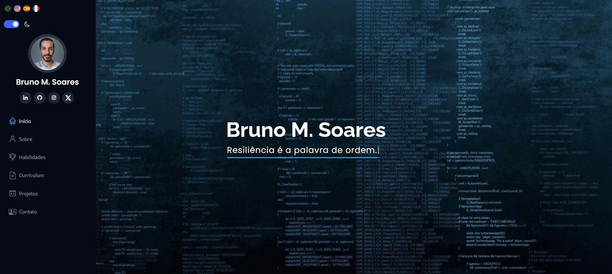

<h1 align="center">Portfolio</h1>

<a href="https://brunomourasoares.github.io/portfolio/" target="_blank" title="Portfolio">Clique para visitar a página do projeto no GitHub Pages</a>

## 📚 Seções
- Opções de 4 linguas.
- Modo Claro e Modo Escuro.
- Foto, nome e links das mídias sociais.
- **Início:** mostrando meu nome e algumas frases de motivação.
- **Sobre:** contém informações sobre mim.
- **Habilidades:** softskills e hardskills adquiridas.
- **Curriculum:** breve resumo do meu curriculum.
- **Projetos:** links dos repositórios.
- **Contato:** informações de contato.

## Tecnologias utilizadas
Desenvolvido com as seguintes tecnologias:
- HTML5
- CSS3
- SCSS
- Bootstrap
- JavaScript

## 

